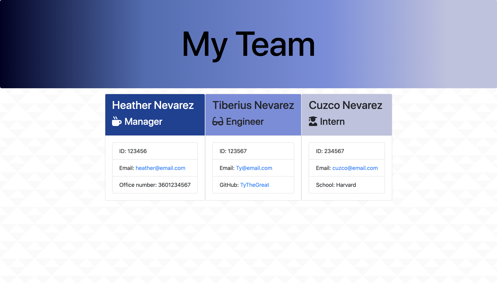

# Team Profile Generator
  
  * [Installation](#installation)
  * [Usage](#usage)
  * [Contributers](#contributing)
  * [Test](#test)
  * [Questions](#questions)
  * [License](#license)
  
  
## Description:
  This app allows users to create a team profile using inquirer and node.js. Users are prompted to enter information about each team member on the CLI, then this information is added to a pre-styled HTML page. Users can enter Managers, Engineers, and Interns, including information specific to each role. 
  ## Installation Instructions:
  For installation follow these instructions: Download "TeamGenerator" to your local drive using Bash/Terminal. In CLI run "npm i" to install all dependencies. Once this is done, run node app.js to run the application and follow the prompts.
  ## Usage Information:
  This app is intended for those who want to create an organized display of their organization's team members. 
  ## Contributers:
  I'd like to thank Jason Roundtree for his contribution to this project! Thank you for helping to create pseudocode for this app that was easy to follow.
  ## Tests:
  Jest was used to test all classes in this project, all tests passed.
## Questions:
If you have any questions please feel free to email me at heather.alv88@yahoo.com or contact me at HeatherNev88 on GitHub!
  ## License: MIT
